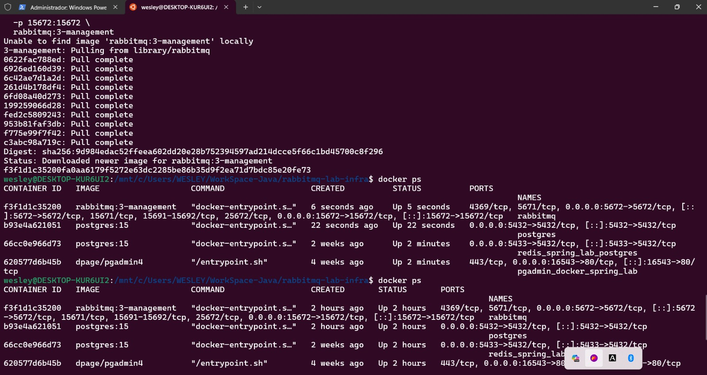

# rabbitmq-lab-infra 🐳

Este repositório representa **uma das 3 partes do projeto de estudos sobre RabbitMQ com microsserviços Java Spring Boot**. Ele é responsável por toda a infraestrutura necessária para que os microsserviços de pedidos e pagamentos se comuniquem via mensageria.

---

## 🧱 O que é este projeto?

`rabbitmq-lab-infra` é o ambiente de infraestrutura Docker que contém:

- 📦 Um container com o **RabbitMQ** com plugin de gerenciamento ativado (painel web)
- 🐘 Um container com o **PostgreSQL** usado pelos microsserviços

Ele permite que os serviços `rabbitmq-pedido-service` e `rabbitmq-pagamento-service` funcionem sem necessidade de instalações manuais no seu sistema.

---

## 🚀 Por que usar um projeto separado para infraestrutura?

Separar o ambiente de infraestrutura em um repositório próprio traz os seguintes benefícios:

- ✅ Organização: cada repositório tem responsabilidade única (infraestrutura, serviço de pedidos, serviço de pagamento)
- 📦 Reutilização: o mesmo ambiente pode ser usado em diferentes cenários de testes
- 🧪 Testes isolados: subir ou derrubar o Docker sem afetar o código Java
- 🌱 Ideal para CI/CD e pipelines automatizados

---

## 📦 O que está incluso?

- **RabbitMQ** com painel ativado (`portas 5672 e 15672`)
- **PostgreSQL** acessível na porta `5432`

```bash
docker-compose.yml
├── services:
│   ├── rabbitmq
│   └── postgres
```

---

## 🐳 Como subir a infraestrutura com Docker

### Pré-requisitos:
- Docker e Docker Compose instalados

### Comandos para iniciar:
```bash
# 1. Acesse a pasta
cd rabbitmq-lab-infra

# 2. Suba os containers
docker-compose up -d
```


---

## 🖥️ Acessos úteis

| Serviço     | URL                              | Usuário | Senha |
|-------------|-----------------------------------|---------|--------|
| RabbitMQ    | http://localhost:15672           | guest   | guest  |
| PostgreSQL  | `jdbc:postgresql://localhost:5432/pedido_db` | postgres | admin   |

Você pode visualizar os dados no **DBeaver** ou **pgAdmin** utilizando as credenciais acima.

---

## 🔗 Integração com os microsserviços

- O `rabbitmq-pedido-service` envia mensagens para a fila `pagamento.pedido`
- O `rabbitmq-pagamento-service` consome essas mensagens e processa o pagamento

Este projeto garante que RabbitMQ e PostgreSQL estejam prontos para que os microsserviços possam operar corretamente.

---

## 📚 Projeto completo

Este repositório faz parte do conjunto de 3 projetos:

| Projeto                      | Função principal                                             |
|-----------------------------|--------------------------------------------------------------|
| `rabbitmq-pedido-service`   | Envia mensagens com pedidos para o RabbitMQ                 |
| `rabbitmq-pagamento-service`| Escuta a fila e processa os pedidos                         |
| `rabbitmq-lab-infra`        | Fornece RabbitMQ e PostgreSQL via Docker Compose            |

---

## 👤 Autor
Wesley Martins Rosa  
📧 Email: wesleymrosa@gmail.com  
🐙 GitHub: [github.com/wesleymrosa](https://github.com/wesleymrosa)  
🔗 LinkedIn: [linkedin.com/in/wesley-martins-rosa-5118aa15a](https://linkedin.com/in/wesley-martins-rosa-5118aa15a)

## 📅 Licença
Projeto com fins educacionais. Sinta-se à vontade para estudar, adaptar e aprimorar.
